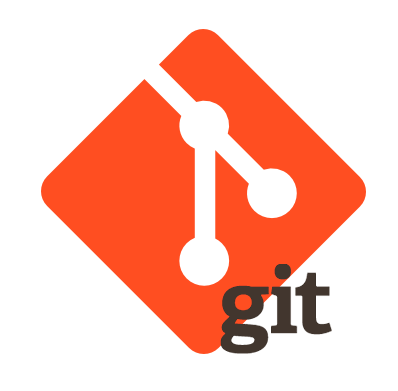

# Hi there, I'm Diana Gutierrez 👋

 ## I`m Electronic Engineer and FrontEnd Developer.

 Focused on the design and development of digital solutions. With knowledge in different programming languages, mainly focused on the JavaScript ecosystem. I love creating tools that improve the interaction between the user and the web. Passionate about technology.

- 🔭 I’m currently working on **Reactjs**.         
- 🌱 I’m currently learning **Reactjs**.
- 📫 How to reach me: **[LinkedIn](https://www.linkedin.com/in/diliguro/)**.
- ⚡ Fun fact: **I love watch anime and read manga**         

## Technologies

**FRONTEND** | **BACKEND** | **DESIGN** | **OTHER**
------------ | ------------| -----------| ------------
      |   |  |  

           

<!--
**lizguroart/lizguroart** is a ✨ _special_ ✨ repository because its `README.md` (this file) appears on your GitHub profile.

Here are some ideas to get you started:

- 🔭 I’m currently working on ...
- 🌱 I’m currently learning ...
- 👯 I’m looking to collaborate on ...
- 🤔 I’m looking for help with ...
- 💬 Ask me about ...
- 📫 How to reach me: ...
- 😄 Pronouns: ...
- ⚡ Fun fact: ...
-->
